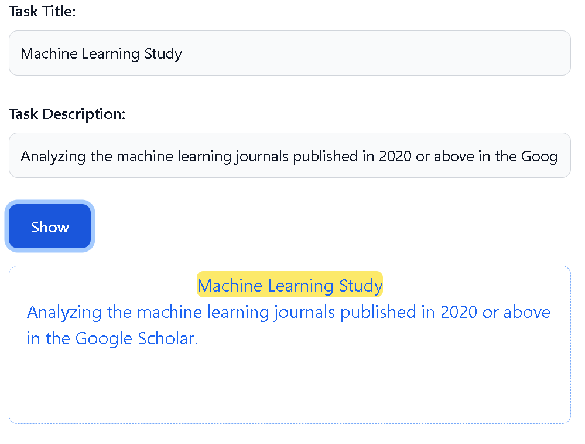

# Display Input Web Page

This repository contains a simple web page that allows users to input task details and display them on the page. The web page is designed using HTML and styled using CSS.

## Table of Contents

- [Overview](#overview)
- [Usage](#usage)
- [Screenshots](#screenshots)
- [Contributing](#contributing)
- [License](#license)

## Overview

The HTML code provided below creates a web page where users can input task details and display them dynamically. The page utilizes Tailwind CSS classes for styling and responsiveness.

```html
<!DOCTYPE html>
<html lang="en">
<head>
    <!-- Meta information -->
    <meta charset="UTF-8">
    <meta http-equiv="X-UA-Compatible" content="IE=edge">
    <meta name="viewport" content="width=device-width, initial-scale=1.0">
    
    <!-- External CSS file -->
    <link rel="stylesheet" href="./dist/output.css">
    
    <!-- Page title -->
    <title>Display Input</title>
</head>
<body>
  <!-- Container with flex layout -->
  <div class="container flex items-center justify-center">
    <!-- Input form -->
    <form class="w-2/3">
        <!-- Task Title input -->
        <div class="mb-6">
            <label for="title" class="block mb-2 text-sm font-medium text-gray-900 dark:text-white">
                Task Title:
            </label>
            <input type="text" id="title" class="bg-gray-50 border border-gray-300 text-gray-900 text-sm rounded-lg focus:ring-blue-500 focus:border-blue-500 block w-full p-2.5 dark:bg-gray-700 dark:border-gray-600 dark:placeholder-gray-400 dark:text-white dark:focus:ring-blue-500 dark:focus:border-blue-500" required>
        </div>
        <!-- Task Description input -->
        <div class="mb-6">
            <label for="desc" class="block mb-2 text-sm font-medium text-gray-900 dark:text-white">
                Task Description:
            </label>
            <input type="text" id="desc" class="bg-gray-50 border border-gray-300 text-gray-900 text-sm rounded-lg focus:ring-blue-500 focus:border-blue-500 block w-full p-2.5 dark:bg-gray-700 dark:border-gray-600 dark:placeholder-gray-400 dark:text-white dark:focus:ring-blue-500 dark:focus:border-blue-500" required>
        </div>
        <!-- Show button -->
        <button type="button" id="showbtn" class="text-white bg-blue-700 hover:bg-blue-800 focus:ring-4 focus:outline-none focus:ring-blue-300 font-medium rounded-lg text-sm w-full sm:w-auto px-5 py-2.5 text-center dark:bg-blue-600 dark:hover:bg-blue-700 dark:focus:ring-blue-800">Show</button>
        <!-- Display area -->
        <div class="mt-4 p-4 flex flex-col items-center justify-start border border-dashed border-blue-400 rounded-lg h-36">
            <div class="bg-yellow-200 rounded-md text-blue-600 flex mt-[-12px]" id="displayZone"></div>
            <div class="text-blue-600 self-start" id="displayArea"></div>
        </div>
    </form>
  </div>
  <!-- Script for dynamic content -->
  <script>
    const displayButton = document.querySelector("#showbtn");
    const inputField1 = document.getElementById("title");
    const inputField2 = document.getElementById("desc");
    const displayZone = document.getElementById("displayZone");
    const displayArea = document.getElementById("displayArea");
    
    displayButton?.addEventListener("click", () => {
        displayZone.textContent = inputField1.value;
        displayArea.textContent = inputField2.value;
    });
  </script>
</body>
</html>
```

## Usage

1. Clone or download this repository to your local machine.
2. Open the `index.html` file in a web browser.

You will see an input form where you can enter task details. After entering the details, click the "Show" button to display the entered task information below the form.

## Screenshots


## Contributing

Contributions are welcome! Feel free to open issues or submit pull requests.

## License

This project is licensed under the [MIT License](LICENSE).

---
## Authors

- [@MohammadMehdiSalehi](https://github.com/mohammadmehdisalehi)


